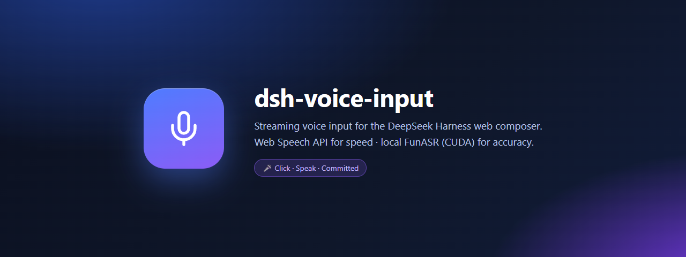
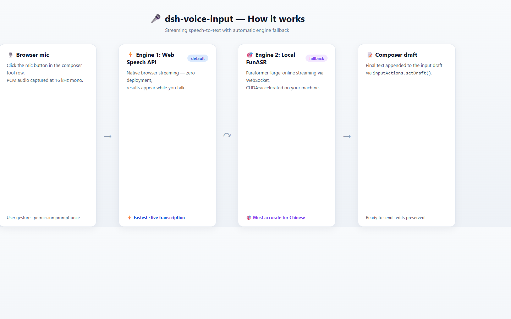

<div align="center">

[**English**](README.md) | [**中文**](README.zh.md)



**为 [DeepSeek Harness](https://github.com/deepseek-ai/deepseek-harness) Web 界面打造的流式语音输入插件。**
**点击麦克风 · 开口说话 · 转写文本实时落入输入框。**

[](https://github.com/fingercd/dsh-voice-input)
[](LICENSE)
[](https://developer.mozilla.org/en-US/docs/Web/API/SpeechRecognition)
[](https://github.com/alibaba-damo-academy/FunASR)
[](https://github.com/deepseek-ai/deepseek-harness)

</div>

---

DSH Web 界面的 **client 插件**：在输入框工具行注入一个麦克风按钮，流式语音识别，**自动引擎回退** —— 速度优先，关键时刻用准确度。

| ⚡ **Web Speech API**（默认） | 🎯 **本地 FunASR**（回退） |
|---|---|
| 浏览器原生流式 · 零部署 · 边说边出字 | Paraformer-large-online · 中文 ASR 事实标准 · CUDA 加速 |
| 最快 —— 逐字实时 | 最准 —— 阿里达摩院 [FunASR](https://github.com/alibaba-damo-academy/FunASR)（15k+ ⭐） |

Web Speech 识别失败（如 Chrome 无法访问 Google 服务）时，插件**自动回退**到本地 FunASR 服务；
也可用 `localStorage` 强制指定引擎。

---

## ✨ 特性

- 🎤 **一键麦克风**：注入 composer 工具行（`conversation.input.left` slot）—— 纯插件，不改官方代码
- 📡 **流式转写**：说话时实时预览（320ms 增量帧），停止后写入输入框
- 🔀 **自动引擎回退**：Web Speech 失败 → 本地 FunASR，无需用户干预
- 🖥️ **CUDA 本地识别**：实测实时率 < 0.1（比实时快 5 倍）
- 📝 **不破坏草稿**：转写文本**追加**到输入框末尾，你正在编辑的内容永不被覆盖
- 🧩 **零构建 bundle**：手写 `__ModuleLoader__.load` 格式，随 dsh web 启动动态加载

## 🏗️ 工作原理



1. 点击麦克风按钮 → 浏览器采集 16kHz 单声道 PCM
2. **Web Speech API** 原生流式识别（Chrome/Edge）；失败时同一音频链路自动切换
   **本地 FunASR**（WebSocket `ws://127.0.0.1:8899/ws`）
3. 识别文本通过 `inputActions.setDraft()` 追加进输入框草稿

## 📸 界面预览


## 🚀 快速开始

### 1. 安装插件（直接从 GitHub 安装）

```powershell
# 无需 clone —— pnpm 直接从仓库安装：
dsh plugin --profile web add "github:fingercd/dsh-voice-input"
# 或使用完整 git URL：
dsh plugin --profile web add "https://github.com/fingercd/dsh-voice-input.git"
```

### 2. 重启 `dsh web` —— 完事

插件自带 `dsh.bundle` patch（`cordis.patch.yml`），`voice-input` 的 roster 行在**安装时自动注册** ——
无需手动编辑 `cordis.patch.yml`，无需 agent 辅助配置。

```powershell
# 重启前可用只读命令验证自动注册：
dsh --profile web --dump-config | findstr voice-input
```

client 插件在启动时动态加载 —— **无需重建前端**。重启 `dsh web` 后刷新页面，麦克风按钮出现在输入框工具行左端。

## 🎯 本地 FunASR 引擎（可选 · 准确度优先）

```powershell
# 一次性安装依赖（Python 3.10+，推荐 torch/torchaudio + CUDA 环境）
powershell -ExecutionPolicy Bypass -File scripts/install_funasr.ps1

# 启动流式服务（首次自动下载 paraformer-large-online 模型 ~840MB，之后秒启）
python scripts/funasr_server.py
# 可选: --port 8899 --device cuda:0   （默认自动检测 GPU）
```

### ⚙️ 配置（浏览器控制台）

```js
localStorage.setItem("dsh.voice.input.engine", "auto");                        // "auto" | "webspeech" | "funasr"
localStorage.setItem("dsh.voice.input.funasrUrl", "ws://127.0.0.1:8899/ws");   // 自定义服务地址
```

## 🔌 FunASR 流式协议

```
客户端 → 服务端:  {"type":"start","lang":"zh"} · 二进制 Int16 PCM @16kHz 单声道 · {"type":"end"}
服务端 → 客户端:  {"type":"partial","text":<增量文本>} · {"type":"final","text":<尾部增量>}
                  {"type":"ok"} · {"type":"error","message":<str>}
```

流式模型输出的是**增量**文本 —— 客户端负责累计拼接（详见 `scripts/funasr_server.py` 文档字符串）。

## 🧩 插件结构

| 文件 | 职责 |
|---|---|
| `lib/index.js` | 宿主侧（node）—— 空 apply，保证进入 Loader roster |
| `lib/client.js` | 浏览器 bundle —— 麦克风按钮、双引擎编排、草稿提交 |
| `cordis.patch.yml` | Bundle patch（`dsh.bundle`）—— 安装时自动注册 `voice-input` roster 行 |
| `scripts/funasr_server.py` | 本地流式识别服务（FastAPI + WebSocket + FunASR） |
| `scripts/install_funasr.ps1` | 一键依赖安装 |

- 注册在 `conversation.input.left` slot；通过 owner 注入的 `useInput` / `inputActions` 读写草稿 —— 与 client-runtime 无深耦合
- bundle 只依赖 shell 静态 externals 表中的 `react`，对版本漂移免疫

## 🤝 参与贡献

欢迎 PR！值得探索的方向：2-pass 模式（修正安全的流式）、音量电平指示、命令（`/`）触发集成、多语言模型切换。

## 📄 开源协议

[MIT](LICENSE) © fingercd
